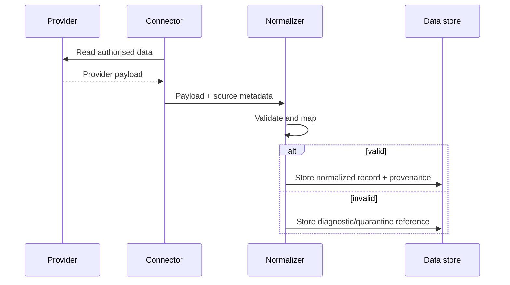
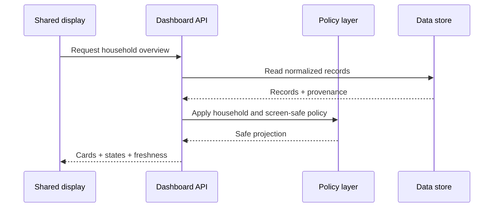
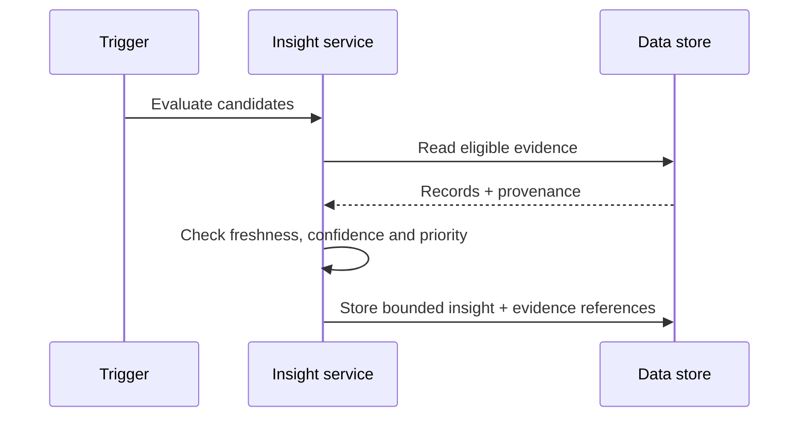

# Runtime Sequences

## Connector ingestion

```mermaid
sequenceDiagram
  participant P as Provider
  participant C as Connector
  participant N as Normalizer
  participant D as Data store
  C->>P: Read authorised data
  P-->>C: Provider payload
  C->>N: Payload + source metadata
  N->>N: Validate and map
  alt valid
    N->>D: Store normalized record + provenance
  else invalid
    N->>D: Store diagnostic/quarantine reference
  end
```

## Shared dashboard read

```mermaid
sequenceDiagram
  participant S as Shared display
  participant A as Dashboard API
  participant P as Policy layer
  participant D as Data store
  S->>A: Request household overview
  A->>D: Read normalized records
  D-->>A: Records + provenance
  A->>P: Apply household and screen-safe policy
  P-->>A: Safe projection
  A-->>S: Cards + states + freshness
```

## Insight generation

```mermaid
sequenceDiagram
  participant T as Trigger
  participant I as Insight service
  participant D as Data store
  T->>I: Evaluate candidates
  I->>D: Read eligible evidence
  D-->>I: Records + provenance
  I->>I: Check freshness, confidence and priority
  I->>D: Store bounded insight + evidence references
```
