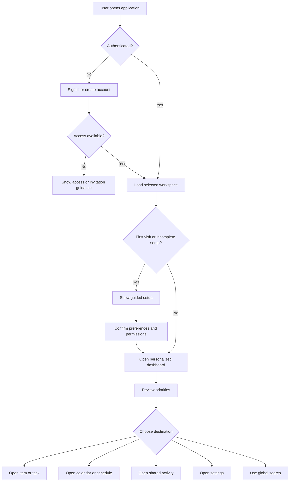
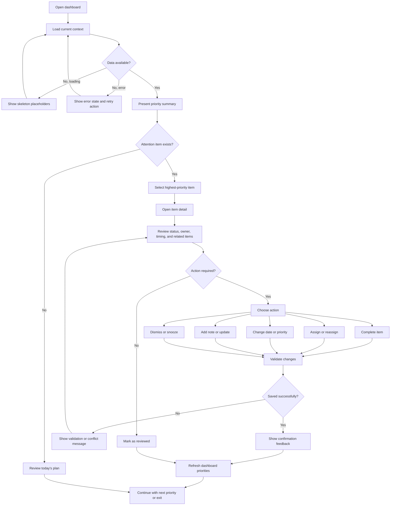
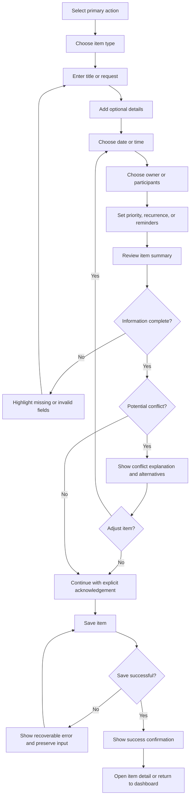
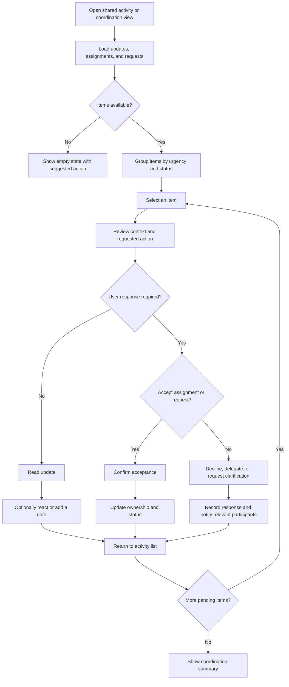
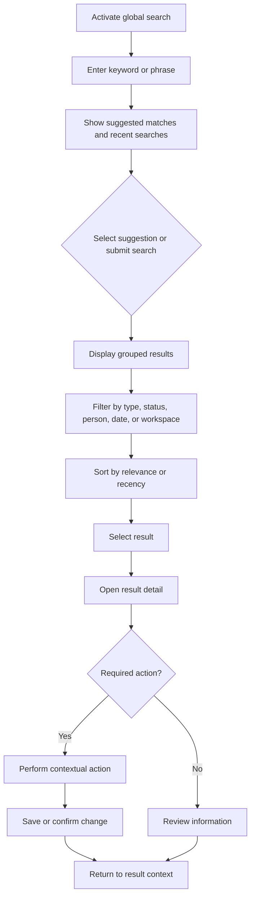
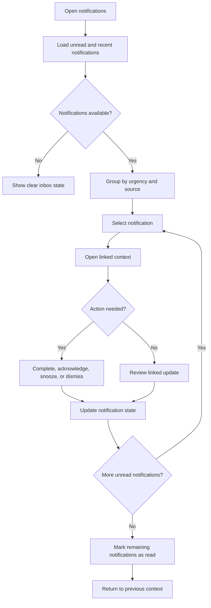
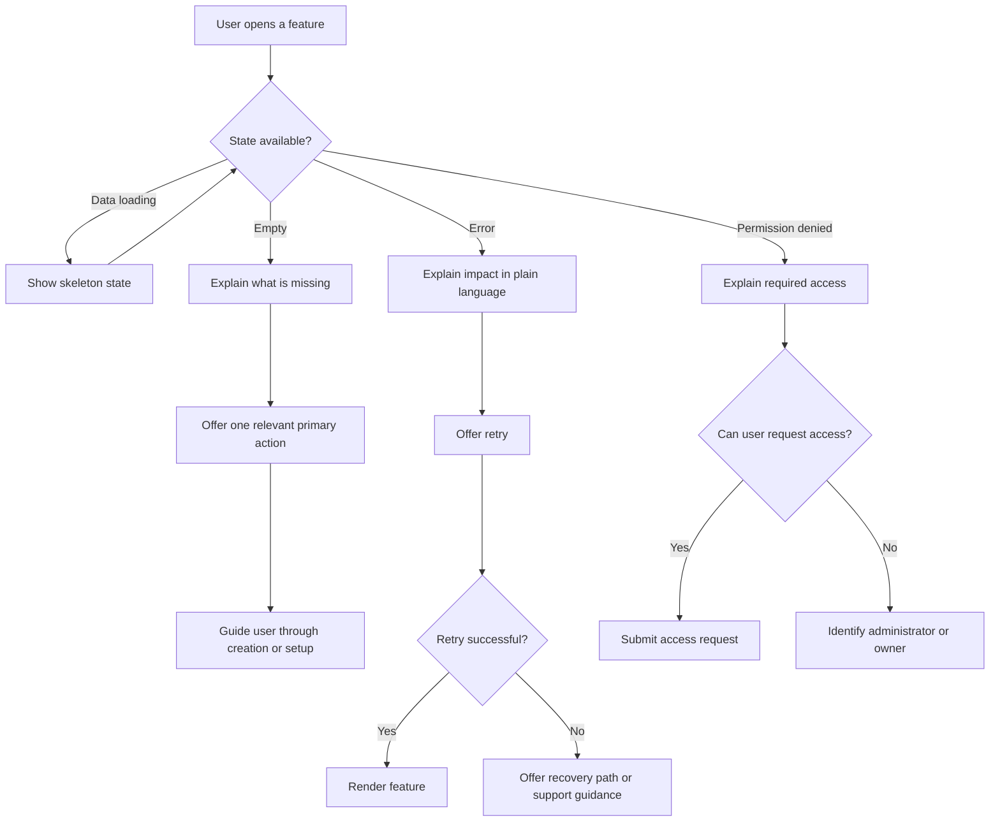

## UX Architecture & Mermaid Flow Diagrams

### Dashboard visual architecture

#### Layout structure

- **Global shell:** Persistent left navigation on desktop; collapsible navigation drawer on tablet and mobile.
- **Top bar:** Current workspace or household selector, global search, notifications, help, and user profile.
- **Page header:** Dashboard title, date or context selector, primary action, and optional secondary actions.
- **Main canvas:** Responsive 12-column grid with a consistent spacing scale and card-based modules.
- **Context rail:** Optional right-side panel for activity, reminders, recommendations, or details; hidden below desktop breakpoints.
- **Mobile layout:** Single-column stacking with bottom navigation for the highest-frequency destinations and a floating primary-action button.

#### Widget hierarchy

1. **Orientation layer**
   - Page title and current context.
   - Status summary.
   - Primary next action.

2. **Priority layer**
   - Attention-required items.
   - Overdue or blocked items.
   - Time-sensitive reminders.
   - Exceptions and unresolved conflicts.

3. **Planning layer**
   - Today or upcoming view.
   - Agenda, tasks, events, and commitments.
   - Progress toward active goals.

4. **Coordination layer**
   - Shared activity.
   - Assigned responsibilities.
   - Recent updates.
   - Requests requiring acknowledgement.

5. **Discovery layer**
   - Suggestions.
   - Frequently used actions.
   - Recent or favourite items.
   - Optional insights.

#### Information density

- Use **high density** only for lists, schedules, and operational status where scanning is the primary task.
- Use **medium density** for summary cards containing one headline metric, a short status label, and one supporting detail.
- Use **low density** for onboarding, empty states, confirmations, and decision points.
- Display no more than **three primary priorities** above the first scroll on desktop.
- Use progressive disclosure for secondary metadata, history, permissions, and advanced settings.
- Make state visible through text labels and icons; do not rely on colour alone.
- Reserve strong accent colours for actionable status, warnings, and completion feedback.
- Keep one dominant action per page or major card.
- Preserve user context when opening details by using drawers or modal panels for short tasks and full-page views for complex workflows.
- Maintain consistent states for loading, empty, error, offline, permission denied, and successful completion.
- Support keyboard focus order that follows the visual hierarchy and ensure all actionable elements have explicit labels.

```mermaid
flowchart TD
    A[Application shell] --> B[Global navigation]
    A --> C[Top bar]
    A --> D[Dashboard canvas]
    A --> E[Context rail]

    B --> B1[Primary destinations]
    B --> B2[Workspace or household switcher]
    B --> B3[Settings and permissions]

    C --> C1[Current context]
    C --> C2[Global search]
    C --> C3[Notifications]
    C --> C4[Help]
    C --> C5[Profile]

    D --> D1[Page header]
    D --> D2[Priority summary]
    D --> D3[Attention-required items]
    D --> D4[Today or upcoming view]
    D --> D5[Shared activity]
    D --> D6[Suggested actions]

    D1 --> D1a[Title and context]
    D1 --> D1b[Primary action]
    D1 --> D1c[Filters or date selector]

    D2 --> D2a[Status metrics]
    D2 --> D2b[Progress indicators]
    D2 --> D2c[Exception count]

    E --> E1[Reminders]
    E --> E2[Recent activity]
    E --> E3[Recommendations]

    D3 --> F[Detail drawer or full-page detail]
    D4 --> F
    D5 --> F
    D6 --> F
```

### Core navigation and orientation

### Dashboard review and action completion

### Create, schedule, or assign an item

### Shared coordination and acknowledgement

### Search and retrieval

### Notifications and reminders

### Empty, error, and permission states

